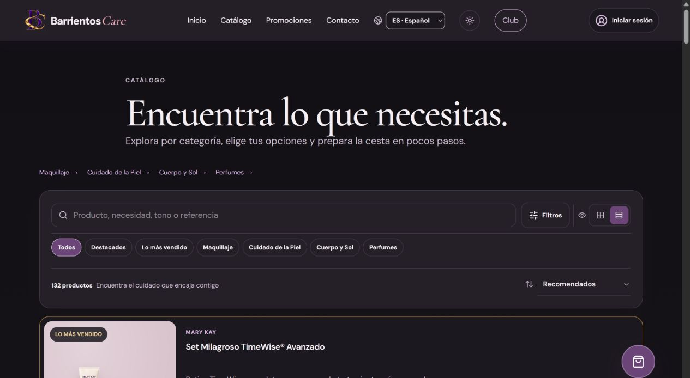

# BarrientosCare / Una web que está trabajando.

**Comercio de belleza publicado en [barrientoscare.es](https://barrientoscare.es).** Identidad visual, catálogo, búsqueda y filtros, variantes, cesta y Club; una experiencia conectada con la gestión privada del negocio.

**Next.js · React · TypeScript**

## La primera prueba es la propia web

[**Visitar BarrientosCare →**](https://barrientoscare.es) · [Capturas y recorrido observado](docs/DEMOSTRACIONES.md)

Se han comprobado la portada y el catálogo públicos. Eso no equivale a certificar un pago completo, las operaciones del negocio o su administración. Los datos de clientes y las integraciones no forman parte de este repositorio.

## El detalle que hace mentir a un filtro

Un sérum tiene una variante de **5 € agotada** y otra de **25 € disponible**. Filtras por menos de 10 €. ¿Debe aparecer? El módulo publicado contesta con la disponibilidad que utiliza para construir el precio de la tarjeta.

[**Probar el catálogo sintético →**](https://calinrus-dev.github.io/barrientoscare-showcase/) · [Código extraído](samples/catalog.js) · [Pruebas de variantes, precios y búsqueda](test/catalog.test.mjs)

~~~sh
node --test test/*.test.mjs
~~~

## Un contrato compartido, menos incoherencia

El filtro y la tarjeta deben hablar del mismo producto. El módulo reúne normalización de búsqueda en español, selección de precios, disponibilidad y ordenación sin mutar el catálogo de entrada.

La decisión tiene límites: son recorridos lineales sobre un catálogo en memoria. Para un volumen grande habría que medir, indexar o mover trabajo; aquí no se anuncia una cifra de escala que no se haya probado. La normalización está pensada para esta búsqueda en español, no como solución universal para todas las escrituras.

[Diseño del catálogo](docs/COMPONENTES.md) · [Arquitectura del sitio](docs/ARQUITECTURA.md) · [Origen y límites](docs/PROVENANCE.md) · [Verificación](docs/VERIFICATION.md) · [Portfolio](https://github.com/calinrus-dev/portfolio)

[Instagram @c4linrus](https://www.instagram.com/c4linrus/) · [LinkedIn / calinrus](https://www.linkedin.com/in/calinrus/)
