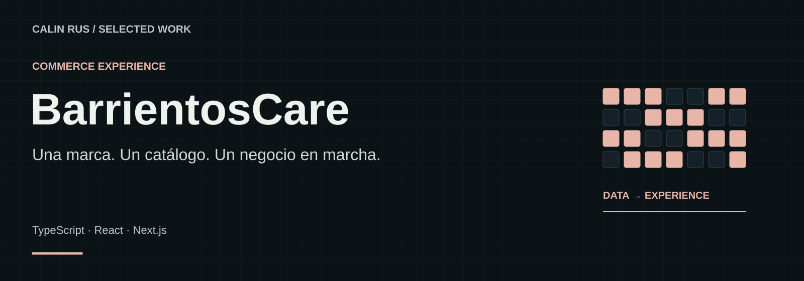

# BarrientosCare

**Un catálogo pensado para elegir.**

Una experiencia de catálogo, selección de productos y gestión comercial con identidad visual propia y un recorrido de compra asistida.

**Stack:** TypeScript · React · Next.js  
**Estado:** Producto en evolución

[Portfolio](https://github.com/calinrus-dev/portfolio) · [Experiencia](docs/EXPERIENCIA.md) · [Componentes](docs/COMPONENTES.md) · [Diseño técnico](docs/ARQUITECTURA.md) · [Demostraciones](docs/DEMOSTRACIONES.md) · [Estado](docs/ESTADO.md)

## El problema que aborda

Un catálogo útil necesita facilitar tanto la elección del cliente como el trabajo de quien lo mantiene. BarrientosCare conecta presentación, selección y gestión dentro del mismo producto.

## Qué compone la experiencia

- **Catálogo.** Exploración por productos, marcas y categorías.
- **Ficha de producto.** Información, variantes e imágenes para tomar una decisión.
- **Cesta y pedido.** Preparación del pedido y continuidad del recorrido.
- **Panel de gestión.** Organización del catálogo y revisión de la actividad comercial.

*Lámina explicativa con datos ficticios. Su contenido también está disponible como texto en [Componentes](docs/COMPONENTES.md).*

## Decisiones que definen el proyecto

- **La ficha ayuda a elegir.** La jerarquía visual da prioridad a la información del producto.
- **La gestión acompaña al catálogo.** Mantener contenido y disponibilidad forma parte del producto.
- **Demostración sin clientes.** El escaparate usa ejemplos editoriales y no reproduce actividad comercial real.

## Explorar el caso

- [Experiencia y recorrido](docs/EXPERIENCIA.md): intención, interacción y criterios de revisión.
- [Componentes](docs/COMPONENTES.md): las piezas visibles y el papel de cada una.
- [Diseño técnico](docs/ARQUITECTURA.md): responsabilidades y compromisos de diseño.
- [Demostraciones](docs/DEMOSTRACIONES.md): qué enseñan las imágenes y cómo leer la evidencia.
- [Estado y siguientes pasos](docs/ESTADO.md): alcance actual, comprobaciones y trabajo pendiente.

## Sobre este repositorio

Caso de estudio público de un proyecto con implementación privada. Reúne documentación, diagramas e imágenes seleccionadas. Los detalles del motor, integraciones, datos operativos y código se mantienen en los repositorios privados.

Revisión editorial: 28 de septiembre de 2026. Autor: [Calin Rus](https://github.com/calinrus-dev).

[calinrus.com](https://calinrus.com) · [Instagram @c4linrus](https://www.instagram.com/c4linrus/) · [Todos los proyectos](https://github.com/calinrus-dev/portfolio)
