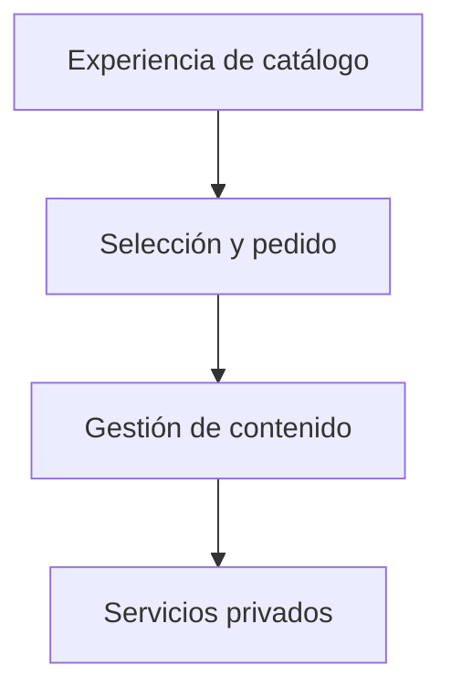

# BarrientosCare / Diseño técnico

[← Inicio](../README.md)

## Contexto

Una web comercial de belleza y cuidado personal publicada en barrientoscare.es. Conecta identidad de marca, catálogo, búsqueda, variantes, cesta y Club con herramientas para mantener el contenido y gestionar la actividad del negocio.

**Tecnologías asociadas al proyecto:** TypeScript · React · Next.js.

## Mapa de responsabilidades

Este mapa conceptual organiza la explicación del producto; no representa endpoints, procesos desplegados ni contratos internos.

## La ficha ayuda a elegir

La jerarquía visual da prioridad a la información del producto.

## La gestión acompaña al catálogo

Mantener contenido y disponibilidad forma parte del producto.

## Demostración sin clientes

El escaparate usa ejemplos editoriales y no reproduce actividad comercial real.

## Rendimiento y dependencia

Mi criterio de trabajo es medir antes de optimizar: identificar el recorrido relevante, observar tiempo de respuesta y uso de recursos y comparar cambios con la misma carga. En sistemas nativos también me interesa la disposición de datos, la localidad de memoria y el trabajo repetido.

Local-first es una preferencia arquitectónica: conservar una experiencia útil y control sobre los datos en el dispositivo, e incorporar servicios externos cuando aporten una función concreta. Su alcance varía por proyecto; no implica que todas las integraciones de este caso funcionen sin conexión.

No se publican cifras de rendimiento sin un ensayo identificado. La evidencia específica disponible está en [Estado](ESTADO.md).

## Qué conviene demostrar después

- Pulir descubrimiento, fichas y continuidad de la cesta.
- Ampliar accesibilidad y estados de error.
- Consolidar la gestión editorial del catálogo.
