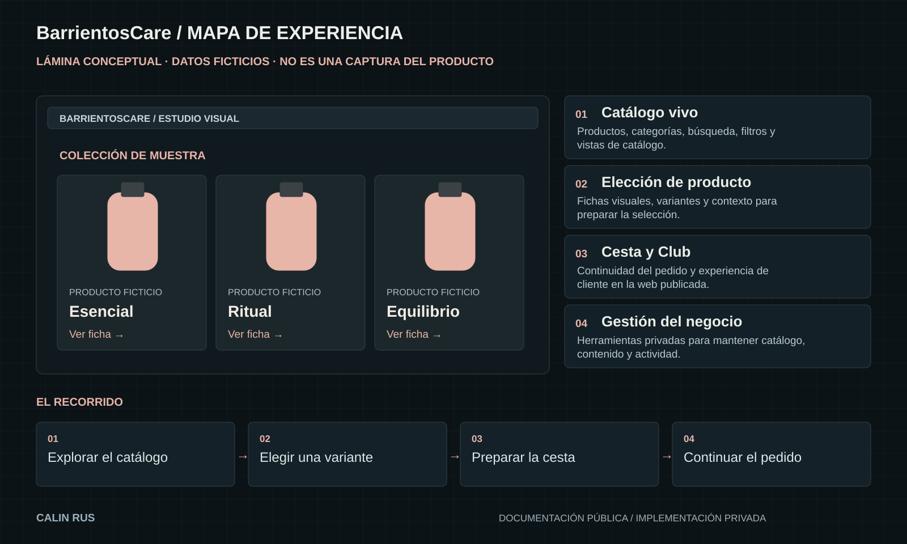

# BarrientosCare / Componentes de producto

[← Inicio](../README.md)

Lámina conceptual con contenido ficticio. Las piezas de esta página describen la experiencia y sus responsabilidades visibles.

## 01 / Catálogo vivo

Productos, categorías, búsqueda, filtros y vistas de catálogo.

**En el recorrido:** Explorar el catálogo.

**Responsabilidad relacionada:** Experiencia de catálogo.

## 02 / Elección de producto

Fichas visuales, variantes y contexto para preparar la selección.

**En el recorrido:** Elegir una variante.

**Responsabilidad relacionada:** Selección y pedido.

## 03 / Cesta y Club

Continuidad del pedido y experiencia de cliente en la web publicada.

**En el recorrido:** Preparar la cesta.

**Responsabilidad relacionada:** Gestión de contenido.

## 04 / Gestión del negocio

Herramientas privadas para mantener catálogo, contenido y actividad.

**En el recorrido:** Continuar el pedido.

**Responsabilidad relacionada:** Servicios privados.

## Relación entre las piezas

Explorar el catálogo → Elegir una variante → Preparar la cesta → Continuar el pedido.

El recorrido permite discutir jerarquía, navegación y continuidad. La representación se simplifica a propósito y no publica los contratos internos de implementación.

[Explorar decisiones de diseño](ARQUITECTURA.md)
