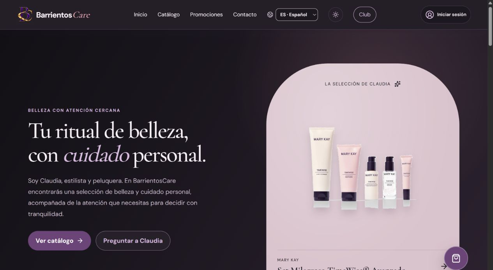

# BarrientosCare / Demostraciones

[← Inicio](../README.md)

## Qué enseña esta publicación

Capturas reales de la portada y del catálogo público de barrientoscare.es, tomadas el 28 de septiembre de 2026.

La web pública puede recorrerse desde su dominio. Las imágenes no muestran el panel interno ni información de clientes.

## Capturas reales

*Portada real de barrientoscare.es, revisada el 28 de septiembre de 2026.*

*Catálogo público real de BarrientosCare. Los datos comerciales pueden cambiar.*

## Guion del caso de estudio

Este guion sirve para explicar el recorrido documentado y preparar una demostración controlada. No afirma que se haya ejecutado completo durante esta publicación.

1. **Explorar el catálogo.** Observar: Productos, categorías, búsqueda, filtros y vistas de catálogo.
2. **Elegir una variante.** Observar: Fichas visuales, variantes y contexto para preparar la selección.
3. **Preparar la cesta.** Observar: Continuidad del pedido y experiencia de cliente en la web publicada.
4. **Continuar el pedido.** Observar: Herramientas privadas para mantener catálogo, contenido y actividad.

## Lectura de la lámina

La ilustración reúne las piezas y sus relaciones. Sus estados, textos de muestra y formas son editoriales. Las capturas reales, cuando existen, aparecen identificadas por separado.

## Evidencia disponible

El 28 de septiembre de 2026 se comprobó en navegador que el dominio público carga la portada y el catálogo, con productos, categorías, controles de búsqueda y acceso a Club. La documentación registra un despliegue publicado. Esta comprobación no realiza compras ni certifica cada integración operativa.

[Alcance y próximos pasos](ESTADO.md)
